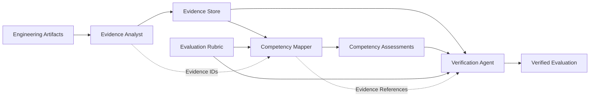

# MidPath AI

> **Evidence-driven engineering readiness assessment for the work that passing tests do not prove.**

MidPath AI is an agentic evaluation system designed to assess software engineering competency from **concrete engineering evidence**, rather than self-reported skills, isolated coding exercises, or test outcomes alone.

A passing test demonstrates that a specific scenario worked under the conditions that were exercised.

It does **not** automatically prove that the implementation provides the engineering guarantees expected in production — such as concurrency safety, transactional consistency, authorization boundaries, failure recovery, or reliable idempotency.

MidPath AI is designed to reason about that gap.

---

## The Problem

Software engineering competency is difficult to evaluate reliably.

Traditional assessment approaches often rely on signals such as:

- self-reported experience;
- technology checklists;
- isolated coding exercises;
- automated test results;
- or a final implementation without explicit evidence of the reasoning and guarantees behind it.

These signals are useful, but incomplete.

A developer may produce code that passes every available test while the implementation still contains an important engineering weakness that the test suite never exercised.

For example:

- sequential requests may pass while concurrent requests violate idempotency;
- multiple persistence operations may succeed on the happy path while partial failures leave inconsistent state;
- an authenticated request may successfully update a resource while ownership authorization is never enforced.

In each case, the visible behavior can appear correct while an important production guarantee remains unsupported.

This creates a fundamental distinction:

> **Passing tests are evidence of tested behavior. They are not, by themselves, proof of an engineering guarantee.**

MidPath AI makes that distinction explicit.

---

## What MidPath AI Does

MidPath AI analyzes engineering artifacts and builds a structured chain from **observable evidence** to **engineering judgment**.

Instead of asking only:

> *“Does this developer know idempotency?”*

MidPath asks:

> *“What evidence in the engineering artifacts supports that conclusion, what guarantee does that evidence establish, and what remains unproven?”*

The system decomposes the evaluation into specialized stages that:

1. inspect engineering artifacts;
2. extract concrete evidence;
3. map that evidence to engineering competencies;
4. identify important reliability or correctness gaps;
5. verify whether the resulting conclusions are supported by the extracted evidence.

The output is therefore not intended to be just another AI-generated score.

It is intended to be a **traceable engineering judgment**.

---

## Core Principle: Evidence Before Judgment

MidPath follows one central rule:

> **No engineering conclusion without evidence.**

The evaluation chain is:

**Engineering Artifact → Evidence → Competency Assessment → Critical Finding → Verification**

Each stage has a distinct responsibility.

Engineering artifacts provide the observable source material.

Evidence records what can actually be supported by those artifacts.

Competency assessments infer engineering capability from that evidence.

Critical findings identify gaps between observed behavior and stronger engineering guarantees.

Verification checks whether the conclusions remain connected to concrete evidence rather than unsupported model reasoning.

This creates a separation between three questions that are often incorrectly collapsed into one:

1. **What did the implementation demonstrably do?**
2. **What engineering guarantees are actually supported by that evidence?**
3. **What competency level can reasonably be inferred from those guarantees?**

That separation is the foundation of MidPath AI.

---

## System Architecture

MidPath AI is structured as a multi-stage agentic evaluation pipeline.

The architecture deliberately separates **observation**, **inference**, and **verification** rather than asking a single model invocation to inspect the artifacts and produce an unstructured final judgment.


### Why an Agentic Workflow?

A single LLM call could read the artifacts, assign competency levels, and produce a final explanation.

That would be simpler.

It would also collapse several fundamentally different reasoning tasks into one opaque operation.

MidPath instead decomposes the evaluation because each stage answers a different question:

| Stage | Primary Question | Responsibility |
|---|---|---|
| **Evidence Analyst** | What can actually be observed in the artifacts? | Extract concrete, referenceable engineering evidence without assigning competency levels. |
| **Competency Mapper** | What competency level is supported by that evidence? | Evaluate the extracted evidence against an explicit competency rubric. |
| **Verification Agent** | Are the conclusions actually justified by the available evidence? | Inspect assessments and evidence references, surface critical gaps, and preserve traceability. |

This separation creates explicit intermediate state between reasoning stages.

Rather than allowing one model response to simultaneously decide **what happened**, **what it means**, and **whether its own conclusion is justified**, MidPath makes those decisions independently inspectable.

The agentic decomposition provides four architectural properties:

1. **Separation of concerns** — evidence extraction, competency inference, and verification have different responsibilities.
2. **Traceability** — downstream conclusions can reference stable Evidence IDs rather than relying only on natural-language rationale.
3. **Inspectability** — intermediate outputs can be examined independently when an evaluation is unexpected or incorrect.
4. **Extensibility** — individual stages can evolve, be replaced, or be evaluated independently without redesigning the entire workflow.

The purpose of the multi-stage architecture is therefore not to maximize the number of agents.

It is to introduce **reasoning boundaries where engineering judgment benefits from explicit evidence and independent verification**.

### Agent 1 — Evidence Analyst

The **Evidence Analyst** is the observation boundary of the MidPath workflow.

Its responsibility is deliberately narrow:

> **Extract what the submitted engineering artifacts actually support — and nothing more.**

It receives the engineering task together with the submitted artifacts and converts them into atomic evidence records.

#### Input

```ts
{
  caseId: string;
  task: string;
  artifacts: Array<{
    path: string;
    content: string;
  }>;
}
```

The artifacts are treated as the source of truth for the analysis.

The agent is explicitly instructed not to assume infrastructure, database constraints, transaction semantics, deployment configuration, or runtime guarantees that are not visible in those artifacts.

#### Output

The Evidence Analyst produces a structured `EvidenceAnalysis`:

```ts
{
  caseId: string;
  evidence: Array<{
    id: string;
    artifact: string;
    observation: string;
    evidenceType:
      | "implementation"
      | "test"
      | "contract"
      | "missing";
    confidence: number;
  }>;
}
```

Each evidence item is intended to represent one focused engineering observation.

Evidence can describe:

- implementation behavior;
- test coverage;
- explicit contracts;
- or an important guarantee that is not demonstrated by the available artifacts.

The `artifact` field preserves provenance, while the Evidence ID provides a stable reference that downstream stages can use when producing competency assessments and verification findings.

#### Reasoning Boundary

The Evidence Analyst is explicitly prohibited from:

- assigning competency scores;
- classifying proficiency;
- recommending learning resources;
- inferring guarantees that are not demonstrated;
- treating passing tests as proof of behavior that the tests never exercised.

This boundary is important.

The Evidence Analyst answers:

> **“What can we support from the artifacts?”**

It does **not** answer:

> **“What competency level does this imply?”**

That decision belongs to the next stage.

#### Runtime Validation

MidPath does not accept the model response blindly.

The Evidence Analyst response is parsed and validated before it can enter the next stage of the workflow.

The implementation rejects responses when:

- the output is not valid JSON;
- the returned `caseId` does not match the evaluated case;
- the `evidence` collection is missing;
- required evidence fields have invalid types;
- `confidence` is outside the range `0..1`;
- or an unsupported evidence type is returned.

This creates a structured boundary between probabilistic model inference and deterministic application logic.

The result is a typed, validated evidence representation that downstream agents can inspect and reference.

### Agent 2 — Competency Mapper

The **Competency Mapper** is the inference boundary of the MidPath workflow.

Its responsibility is to determine what competency level is supported by the evidence produced in the previous stage.

A critical architectural constraint is that the Competency Mapper **does not receive the original engineering artifacts**.

It receives only:

1. the explicit competency rubric; and
2. the validated `EvidenceAnalysis`.

This prevents the mapping stage from independently reinterpreting the source artifacts and bypassing the evidence representation established by the Evidence Analyst.

#### Input

```ts
{
  caseId: string;
  rubric: string;
  evidenceAnalysis: EvidenceAnalysis;
}
```

The rubric defines the competencies that must be evaluated.

The evidence analysis defines the observations that the mapper is allowed to use.

The mapper is explicitly instructed to use only supplied evidence, avoid inventing implementation details or guarantees, and avoid creating competencies that are not present in the rubric.

#### Output

The Competency Mapper produces a structured `CompetencyMapping`:

```ts
{
  caseId: string;
  assessments: Array<{
    competency: string;
    level: number;
    evidenceIds: string[];
    missingEvidence: string[];
    justification: string;
  }>;
}
```

A competency assessment therefore contains more than a level.

It records:

- the competency being evaluated;
- the assigned level;
- the Evidence IDs supporting that assessment;
- evidence that would be required to justify a stronger conclusion;
- and a grounded justification.

This makes the assessment inspectable rather than reducing the evaluation to an isolated numeric score.

#### Reasoning Boundary

The Competency Mapper answers:

> **“What competency level is supported by the available evidence?”**

It does not answer:

> **“What else might be true about the implementation?”**

The agent is explicitly instructed not to invent tests, infrastructure, runtime behavior, implementation details, or engineering guarantees that are absent from the supplied evidence.

It must also distinguish ordinary successful behavior from stronger reliability guarantees.

For example, evidence that a sequential request succeeds cannot automatically establish concurrency safety, just as a successful happy path cannot automatically establish transactional recovery behavior.

When the available evidence is insufficient to justify a stronger level, the mapper records the relevant gap in `missingEvidence`.

#### Evidence Referential Integrity

Evidence references produced by the model are validated against the actual Evidence IDs created by the upstream Evidence Analyst.

For each assessment:

```text
Competency Assessment
        ↓
evidenceIds[]
        ↓
Validated against
        ↓
EvidenceAnalysis.evidence[].id
```

An assessment cannot successfully reference an Evidence ID that does not exist in the current evidence analysis.

This creates a deterministic referential boundary around an otherwise probabilistic inference step.

#### Rubric Conformance

The application also validates the structure of the competency mapping.

The implementation requires:

- every competency defined by the rubric to be assessed exactly once;
- no additional competencies;
- no duplicate competency assessments;
- integer competency levels within the supported `0..3` range;
- structured `evidenceIds` and `missingEvidence` collections;
- and a textual justification for each assessment.

The rubric itself is parsed before the mapping can be accepted, and malformed rubric input is rejected.

Together, these checks prevent structurally invalid model output from silently entering the next stage of the evaluation pipeline.

#### Transient Failure Handling

The Competency Mapper also distinguishes between transient provider failures and exhausted quota.

Transient model errors such as `503 / UNAVAILABLE` are retried with bounded incremental delay.

Quota exhaustion is treated as non-retryable, preventing repeated requests when immediate retry cannot resolve the failure.

This behavior keeps infrastructure failure handling separate from engineering evaluation logic.

The resulting `CompetencyMapping` is therefore a structured inference layer between validated engineering evidence and downstream verification.