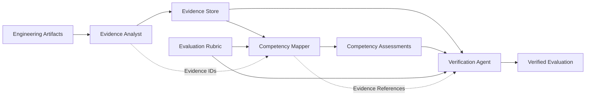

# MidPath AI

> **Evidence-driven engineering readiness assessment for the work that passing tests do not prove.**

MidPath AI is an agentic evaluation system designed to assess software engineering competency from **concrete engineering evidence**, rather than self-reported skills, isolated coding exercises, or test outcomes alone.

A passing test demonstrates that a specific scenario worked under the conditions that were exercised.

It does **not** automatically prove that the implementation provides the engineering guarantees expected in production — such as concurrency safety, transactional consistency, authorization boundaries, failure recovery, or reliable idempotency.

MidPath AI is designed to reason about that gap.

---

## The Problem

Software engineering competency is difficult to evaluate reliably.

Traditional assessment approaches often rely on signals such as:

- self-reported experience;
- technology checklists;
- isolated coding exercises;
- automated test results;
- or a final implementation without explicit evidence of the reasoning and guarantees behind it.

These signals are useful, but incomplete.

A developer may produce code that passes every available test while the implementation still contains an important engineering weakness that the test suite never exercised.

For example:

- sequential requests may pass while concurrent requests violate idempotency;
- multiple persistence operations may succeed on the happy path while partial failures leave inconsistent state;
- an authenticated request may successfully update a resource while ownership authorization is never enforced.

In each case, the visible behavior can appear correct while an important production guarantee remains unsupported.

This creates a fundamental distinction:

> **Passing tests are evidence of tested behavior. They are not, by themselves, proof of an engineering guarantee.**

MidPath AI makes that distinction explicit.

---

## What MidPath AI Does

MidPath AI analyzes engineering artifacts and builds a structured chain from **observable evidence** to **engineering judgment**.

Instead of asking only:

> *“Does this developer know idempotency?”*

MidPath asks:

> *“What evidence in the engineering artifacts supports that conclusion, what guarantee does that evidence establish, and what remains unproven?”*

The system decomposes the evaluation into specialized stages that:

1. inspect engineering artifacts;
2. extract concrete evidence;
3. map that evidence to engineering competencies;
4. identify important reliability or correctness gaps;
5. verify whether the resulting conclusions are supported by the extracted evidence.

The output is therefore not intended to be just another AI-generated score.

It is intended to be a **traceable engineering judgment**.

---

## Core Principle: Evidence Before Judgment

MidPath follows one central rule:

> **No engineering conclusion without evidence.**

The evaluation chain is:

**Engineering Artifact → Evidence → Competency Assessment → Critical Finding → Verification**

Each stage has a distinct responsibility.

Engineering artifacts provide the observable source material.

Evidence records what can actually be supported by those artifacts.

Competency assessments infer engineering capability from that evidence.

Critical findings identify gaps between observed behavior and stronger engineering guarantees.

Verification checks whether the conclusions remain connected to concrete evidence rather than unsupported model reasoning.

This creates a separation between three questions that are often incorrectly collapsed into one:

1. **What did the implementation demonstrably do?**
2. **What engineering guarantees are actually supported by that evidence?**
3. **What competency level can reasonably be inferred from those guarantees?**

That separation is the foundation of MidPath AI.

---

## System Architecture

MidPath AI is structured as a multi-stage agentic evaluation pipeline.

The architecture deliberately separates **observation**, **inference**, and **verification** rather than asking a single model invocation to inspect the artifacts and produce an unstructured final judgment.

### Why an Agentic Workflow?

A single LLM call could read the artifacts, assign competency levels, and produce a final explanation.

That would be simpler.

It would also collapse several fundamentally different reasoning tasks into one opaque operation.

MidPath instead decomposes the evaluation because each stage answers a different question:

| Stage | Primary Question | Responsibility |
|---|---|---|
| **Evidence Analyst** | What can actually be observed in the artifacts? | Extract concrete, referenceable engineering evidence without assigning competency levels. |
| **Competency Mapper** | What competency level is supported by that evidence? | Evaluate the extracted evidence against an explicit competency rubric. |
| **Verification Agent** | Are the conclusions actually justified by the available evidence? | Inspect assessments and evidence references, surface critical gaps, and preserve traceability. |

This separation creates explicit intermediate state between reasoning stages.

Rather than allowing one model response to simultaneously decide **what happened**, **what it means**, and **whether its own conclusion is justified**, MidPath makes those decisions independently inspectable.

The agentic decomposition provides four architectural properties:

1. **Separation of concerns** — evidence extraction, competency inference, and verification have different responsibilities.
2. **Traceability** — downstream conclusions can reference stable Evidence IDs rather than relying only on natural-language rationale.
3. **Inspectability** — intermediate outputs can be examined independently when an evaluation is unexpected or incorrect.
4. **Extensibility** — individual stages can evolve, be replaced, or be evaluated independently without redesigning the entire workflow.

The purpose of the multi-stage architecture is therefore not to maximize the number of agents.

It is to introduce **reasoning boundaries where engineering judgment benefits from explicit evidence and independent verification**.