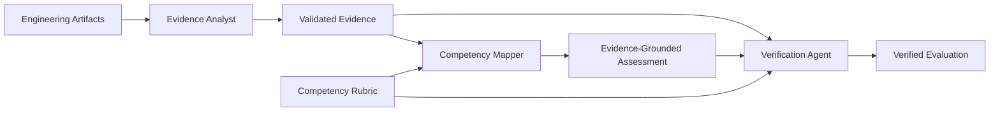

# MidPath AI

> **Evidence-driven engineering readiness assessment for the work that passing tests do not prove.**

MidPath AI is an agentic evaluation system for assessing software engineering competency from **concrete engineering evidence**.

It is built around a simple distinction:

> **Passing tests are evidence of tested behavior. They are not, by themselves, proof of an engineering guarantee.**

A test can demonstrate that a scenario worked. It cannot automatically establish stronger production guarantees such as concurrency safety, transactional consistency, authorization boundaries, failure recovery, or reliable idempotency.

MidPath evaluates the gap between **what an implementation appears to do** and **what its artifacts actually support as an engineering conclusion**.

---

## At a Glance

| | |
|---|---|
| **Problem** | Engineering assessments often confuse passing tests with demonstrated production guarantees. |
| **Approach** | Extract evidence first, map evidence to competency, then independently verify the conclusions. |
| **Architecture** | Evidence Analyst → Competency Mapper → Verification Agent |
| **Experimental Control** | Single-call, non-agentic evaluator using the same model family and benchmark inputs. |
| **Benchmark** | Three failure classes: concurrency, transaction consistency, and authorization. |
| **Evaluation** | Exact Match Rate, MAE, critical-risk detection, severity match, and evidence traceability. |
| **Key Result** | MidPath matched the Baseline's competency accuracy in the two completed paired cases while producing 100% resolvable evidence references in scored downstream conclusions. |

---

## The Problem

Software engineering competency is difficult to evaluate reliably.

Common assessment signals include:

- self-reported experience;
- technology checklists;
- isolated coding exercises;
- automated test results;
- final implementations.

These signals are useful, but incomplete.

An implementation can pass every supplied test while still failing to demonstrate an important production guarantee.

Three examples drive the current benchmark:

```text
Sequential duplicate handling
does not prove
concurrency-safe idempotency.

Happy-path persistence
does not prove
atomic multi-write behavior.

Authentication
does not prove
resource-level authorization.
```

MidPath is designed to make those distinctions explicit.

---

## MidPath in 30 Seconds

MidPath separates engineering assessment into three reasoning boundaries.



### 1. Evidence Analyst

Answers:

> **What can actually be supported by the submitted artifacts?**

It extracts atomic evidence without assigning competency levels.

### 2. Competency Mapper

Answers:

> **What competency level is supported by that evidence?**

It receives the rubric and validated evidence, but **not the original artifacts**.

### 3. Verification Agent

Answers:

> **Are the resulting conclusions actually supported by the available evidence?**

It verifies assessments, identifies supported critical findings, and preserves evidence references.

The complete reasoning path is:

```text
Engineering Artifacts
        ↓
Evidence Analyst
        ↓
Validated Evidence
        ↓
Competency Mapper
        ↓
Evidence-Grounded Assessment
        ↓
Verification Agent
        ↓
Verified Evaluation
```

The goal is not to maximize the number of agents.

The goal is to introduce **explicit reasoning boundaries where engineering judgment benefits from evidence and independent verification**.

---

## Key Benchmark Results

MidPath is compared with a deliberately simple non-agentic Baseline.

The Baseline receives the task, rubric, implementation artifact, and test artifact directly and produces its assessment in one model interaction.

The current frozen benchmark results are:

| Case | Evaluator | Exact Match | MAE | Critical Domain Detected | Severity Match | Traceability |
|---|---|---:|---:|---|---|---|
| **001 — Idempotency** | Baseline | 60% | 0.40 | Yes | Yes | Not comparable |
| | MidPath | 60% | 0.40 | Yes | Yes | 100% assessments / 100% findings |
| **002 — Transaction Consistency** | Baseline | 80% | 0.20 | Yes | Yes | Not comparable |
| | MidPath | 80% | 0.20 | Yes | Yes | 100% assessments / 100% findings |
| **003 — Authorization Boundary** | Baseline | 40% | 0.60 | Yes | No | Not comparable |
| | MidPath | Unavailable | — | — | — | — |

### What the Results Actually Show

The completed paired runs do **not** show a competency-classification accuracy advantage for MidPath.

That is an important result rather than something to hide.

In Cases 001 and 002:

- Baseline and MidPath produced the same Exact Match Rate;
- Baseline and MidPath produced the same MAE;
- both detected the expected critical engineering-risk domain;
- both matched the expected severity.

MidPath's measurable distinction in the completed paired runs is **structured evidence traceability**.

Its scored downstream assessments and critical findings retained references that resolved to Evidence IDs produced by the Evidence Analyst.

The defensible conclusion is therefore:

> **MidPath did not outperform the direct Baseline on competency-score accuracy in the completed paired cases. It did produce an explicit, machine-checkable evidence chain across its reasoning stages.**

This is an architectural auditability result, not a claim of general model superiority.

---

## Why Traceability Matters

A direct LLM can produce a correct engineering conclusion.

The experimental question is not whether an LLM can identify a race condition, transaction risk, or missing authorization check.

The harder question is:

> **Can the system preserve a structured path from the final judgment back to concrete evidence?**

MidPath uses stable Evidence IDs across reasoning stages.

```text
Submitted Artifact
        ↓
Evidence Item: E-03
        ↓
Competency Assessment
evidenceIds: ["E-03"]
        ↓
Verified Assessment
evidenceIds: ["E-03"]
        ↓
Critical Finding
evidenceIds: ["E-03"]
```

The application validates those references deterministically.

An unknown Evidence ID is rejected rather than silently accepted.

### Traceability Is Not Accuracy

Traceability and correctness are different properties.

```text
Accuracy
    ↓
Did the conclusion match
the benchmark reference?

Traceability
    ↓
Can the conclusion be resolved
to structured evidence?
```

A conclusion can be perfectly traceable and still be wrong.

Likewise, the Baseline can reach a correct conclusion without using MidPath's Evidence ID architecture.

For that reason, Baseline traceability is **not reported as 0%**.

The two systems use different evidence representations, so MidPath traceability is reported as an architectural property rather than an apples-to-apples accuracy metric.

---

## Architecture

### Evidence Analyst — Observation Boundary

The Evidence Analyst receives:

```ts
{
  caseId: string;
  task: string;
  artifacts: Array<{
    path: string;
    content: string;
  }>;
}
```

It produces:

```ts
interface EvidenceAnalysis {
  caseId: string;
  evidence: Array<{
    id: string;
    artifact: string;
    observation: string;
    evidenceType:
      | "implementation"
      | "test"
      | "contract"
      | "missing";
    confidence: number;
  }>;
}
```

The artifacts are treated as the source of truth.

The agent is instructed not to:

- assign competency levels;
- invent implementation details;
- assume infrastructure or database constraints;
- infer transaction semantics that are not visible;
- promote passing tests into guarantees they did not exercise.

Its output is parsed and validated before entering the next stage.

Validation includes:

- valid JSON;
- expected `caseId`;
- required evidence collection;
- required field types;
- supported evidence types;
- confidence within `0..1`.

This creates a deterministic application boundary around probabilistic model inference.

---

### Competency Mapper — Inference Boundary

The Competency Mapper receives:

```ts
{
  caseId: string;
  rubric: string;
  evidenceAnalysis: EvidenceAnalysis;
}
```

A deliberate architectural constraint is that it **does not receive the original engineering artifacts**.

It operates only on the explicit rubric and the validated evidence representation.

Its output is:

```ts
interface CompetencyAssessment {
  competency: string;
  level: number;
  evidenceIds: string[];
  missingEvidence: string[];
  justification: string;
}
```

Each assessment therefore records:

- the competency;
- the assigned level;
- evidence supporting that level;
- missing evidence for stronger conclusions;
- a justification.

The application validates that:

- every rubric competency is assessed exactly once;
- no unknown competency is introduced;
- no competency is duplicated;
- levels are integers in the supported `0..3` range;
- evidence and missing-evidence collections are structured;
- justifications are textual;
- referenced Evidence IDs exist in the upstream evidence analysis.

Conceptually:

```text
Competency Assessment
        ↓
evidenceIds[]
        ↓
Referential Validation
        ↓
EvidenceAnalysis.evidence[].id
```

Transient provider errors such as `503 / UNAVAILABLE` can be retried with bounded incremental delay.

Quota exhaustion is treated as non-retryable.

---

### Verification Agent — Supportability Boundary

The Verification Agent receives:

```ts
{
  caseId: string;
  rubric: string;
  evidenceAnalysis: EvidenceAnalysis;
  competencyMapping: CompetencyMapping;
}
```

It does not receive the original artifacts and does not receive the gold standard.

It can:

- preserve supported competency levels;
- reduce levels that are not adequately supported;
- correct unsupported claims;
- identify evidence-supported critical findings;
- record verification notes.

Its final structure contains verified assessments and critical findings such as:

```ts
interface CriticalFinding {
  severity:
    | "low"
    | "medium"
    | "high"
    | "critical";
  competency: string;
  summary: string;
  evidenceIds: string[];
}
```

The application validates:

- expected `caseId`;
- rubric competency coverage;
- duplicate and unknown competencies;
- supported level range;
- assessment Evidence IDs;
- critical-finding Evidence IDs;
- critical-finding competency;
- severity enum;
- structured missing evidence;
- textual justifications and verification notes.

The Verification Agent does not guarantee that model reasoning is objectively correct.

It makes the reasoning **inspectable, constrained, and traceable**.

---

## Baseline vs. MidPath

The Baseline exists to separate the capability of the underlying language model from the contribution of the MidPath architecture.

### Baseline

```text
Task
  +
Rubric
  +
Engineering Artifacts
        ↓
Single Model Evaluation
        ↓
Competency Assessments
+ Critical Findings
```

### MidPath

```text
Task + Engineering Artifacts
        ↓
Evidence Analyst
        ↓
Validated Evidence
        ↓
Competency Mapper + Rubric
        ↓
Evidence-Grounded Assessment
        ↓
Verification Agent + Rubric
        ↓
Verified Evaluation
```

### Architectural Comparison

| Baseline | MidPath |
|---|---|
| Single inference step | Multi-stage agentic workflow |
| Direct artifact access | Explicit evidence boundary |
| Natural-language artifact evidence | Stable Evidence IDs |
| Assessment produced directly | Assessment independently verified |
| Critical findings produced directly | Findings verified against structured evidence |

Both evaluation paths are scored against the same predefined gold standard.

The experiment does **not** assume that adding agents should improve classification accuracy.

It asks what explicit evidence and verification boundaries add to direct model evaluation.

---

## Experimental Methodology

### Gold Standard Isolation

Each benchmark case contains an independently authored reference assessment.

The gold standard is not supplied during inference.

```text
Task + Artifacts + Rubric
          ↓
       Evaluator
          ↓
    Produced Result

-------------------------

Gold Standard
      +
Produced Result
      ↓
Offline Scoring
```

For each competency, the gold standard records:

```ts
{
  competency: string;
  expected_level: number;
  label: string;
  supported_evidence: Array<{
    artifact: string;
    observation: string;
  }>;
  missing_evidence: string[];
  justification: string;
}
```

Each case also defines a reference critical finding containing its expected competency, severity, evidence, and failure scenario.

### Predefined and Frozen

Gold standards are defined before evaluator execution.

Completed model outputs are treated as **frozen experimental observations**.

They are not repeatedly regenerated until a favorable result appears.

This matters because model inference is probabilistic and repeated executions can produce different assessments.

The project therefore preserves the recorded run rather than silently turning stochasticity into benchmark optimization.

---

## Benchmark Design

Each benchmark case contains:

```text
task.md
rubric.json
gold-standard.json
implementation artifact
test artifact
```

The cases are intentionally small enough to inspect while containing a failure mode that requires engineering judgment beyond checking whether the supplied tests pass.

### Case 001 — Idempotency Reliability

**Primary risk:** concurrent duplicate payment processing.

The implementation handles sequential duplicate requests using the same idempotency key.

The supplied tests verify that behavior.

The relevant operations, however, are separate:

```text
Check idempotency key
        ↓
Create payment
        ↓
Persist idempotency record
```

The artifacts do not demonstrate an atomic boundary around that sequence.

Two concurrent requests can therefore observe the key as absent before either persists the idempotency record.

The benchmark tests whether the evaluator distinguishes:

> “Sequential duplicate requests are handled correctly.”

from:

> “Duplicate payment processing is prevented under concurrency.”

The critical competency is `IDEMPOTENCY_RELIABILITY`.

---

### Case 002 — Transaction Consistency

**Primary risk:** partial writes across multiple persistence operations.

The workflow performs:

```text
Create Order
     ↓
Decrease Inventory
     ↓
Create Payment Attempt
```

The supplied tests demonstrate the expected path and input-validation behavior.

The artifacts do not demonstrate:

- a transaction boundary;
- rollback;
- compensation;
- an equivalent atomicity mechanism.

A failure after an earlier write can therefore leave partial state.

The benchmark tests whether the evaluator distinguishes successful happy-path execution from failure-safe multi-write consistency.

The critical competency is `TRANSACTION_RELIABILITY`.

---

### Case 003 — Authorization Boundary

**Primary risk:** missing resource-level ownership validation.

The implementation receives an authenticated user ID and profile ID.

It validates authentication, loads the requested profile, validates the update data, and performs the update.

The artifacts demonstrate:

```text
Authenticated User
        ↓
Profile Exists
        ↓
Update Profile
```

They do not demonstrate:

```text
Authenticated User
        ↓
Owns Requested Profile
        ↓
Update Profile
```

The supplied tests do not exercise a cross-user ownership scenario.

The benchmark therefore distinguishes **authentication** from **resource-level authorization**.

The critical competency is `AUTHORIZATION_RELIABILITY`.

---

## Evaluation & Scoring

Scoring is performed offline after model inference.

### 1. Exact Match Rate

For each rubric competency:

```text
ExactMatch(i) =
    1, if predictedLevel(i) = expectedLevel(i)
    0, otherwise
```

Aggregate:

```text
Exact Match Rate
=
Exact Competency Matches
────────────────────────
Total Compared Competencies
```

Higher is better.

### 2. Mean Absolute Error

For each competency:

```text
Absolute Error
=
| predictedLevel - expectedLevel |
```

Aggregate:

```text
MAE
=
Σ | predictedLevel - expectedLevel |
───────────────────────────────────
      Number of Competencies
```

Lower is better.

Exact Match measures strict classification agreement.

MAE captures the magnitude of disagreement.

### 3. Critical Finding Detection

The scorer evaluates:

1. whether the evaluator produced a critical finding for the expected competency;
2. whether the severity matched the gold standard.

```ts
{
  detected: boolean;
  severityMatched: boolean;
}
```

The current scorer therefore measures **critical competency detection and severity agreement**.

It does not perform semantic equivalence scoring over finding summaries or failure scenarios.

### 4. Evidence Traceability Coverage

MidPath traceability is calculated from downstream Evidence ID references.

```text
Traceability Coverage
=
Traceable Items
───────────────
Total Items
```

An item is traceable when:

1. it contains at least one Evidence ID;
2. at least one referenced ID exists in the Evidence Analyst output for that execution.

Coverage is reported separately for:

- competency assessments;
- critical findings.

---

## Result Interpretation

The metrics intentionally measure different properties.

| Metric | Question | Direction |
|---|---|---|
| **Exact Match Rate** | Did competency levels match the reference? | Higher |
| **MAE** | How far did predictions deviate from the reference? | Lower |
| **Critical Domain Detection** | Was the expected engineering-risk competency identified? | Yes |
| **Severity Match** | Was the expected severity identified? | Yes |
| **Traceability Coverage** | Do MidPath conclusions resolve to structured evidence? | Higher |

No single metric establishes overall superiority.

The benchmark separates:

```text
Classification Quality
        +
Engineering-Risk Recognition
        +
Evidence Auditability
```

---

## Case 003 and Provider Quota

The Case 003 Baseline run completed and was frozen.

The MidPath run did not complete because the external model provider's free-tier request quota was exhausted during the multi-stage workflow.

The result is therefore reported as:

```text
MidPath Case 003: unavailable
```

It is **not** reported as a zero.

The experiment also did not switch to a different model simply to fill the missing cell.

That decision preserves model comparability with the recorded Baseline and earlier MidPath runs.

It also exposes a practical trade-off of agentic workflows: multiple inference stages increase exposure to provider quotas and transient availability.

---

## Failure Handling

Infrastructure failure is kept separate from engineering judgment.

The workflow distinguishes:

```text
Transient provider failure
        ↓
Bounded retry

Quota exhaustion
        ↓
Do not retry
```

This prevents repeated requests when immediate retry cannot resolve the provider constraint.

It also prevents an infrastructure failure from being interpreted as an engineering assessment result.

---

## Reproducibility

### Requirements

- Node.js 22+
- npm
- Gemini API key

### Install

```bash
npm install
```

Create `.env` locally:

```env
GEMINI_API_KEY=your_gemini_api_key_here
```

The real `.env` file is excluded from version control.

### Run Tests

```bash
npm test
```

### Run the Baseline

Default case:

```bash
npm run baseline
```

Specific case in PowerShell:

```powershell
$env:CASE_ID="case-002-transaction-consistency"
npm run baseline
```

### Run MidPath

Default case:

```bash
npm run midpath
```

Specific case in PowerShell:

```powershell
$env:CASE_ID="case-002-transaction-consistency"
npm run midpath
```

### Score a Case

```powershell
node --import tsx evaluation/scoring/run-scoring.ts
```

Specific case:

```powershell
$env:CASE_ID="case-002-transaction-consistency"
node --import tsx evaluation/scoring/run-scoring.ts
```

### Aggregate Available Results

```powershell
node --import tsx evaluation/scoring/aggregate-results.ts
```

The aggregator discovers benchmark cases and reports the frozen Baseline and MidPath results that are available.

### Benchmark Data

All benchmark artifacts required for reproduction are versioned in the repository under:

```text
evaluation/cases/
├── case-001-idempotency/
├── case-002-transaction-consistency/
└── case-003-authorization-boundary/
```

Each case contains the engineering artifacts and predefined evaluation material required by the benchmark.

The recorded evaluator outputs are stored separately under:

```text
evaluation/results/
├── baseline/
└── midpath/
```

Completed recorded outputs are intentionally frozen and should not be regenerated merely to obtain a different stochastic model response.

### Expected Outputs

A successful evaluator execution produces a structured assessment for the selected benchmark case.

The scoring command reports metrics including:

- Exact Match Rate;
- Mean Absolute Error (MAE);
- critical-domain detection;
- severity match;
- MidPath evidence traceability where applicable.

The aggregation step reports the available frozen results across benchmark cases.

For the recorded experiment, the expected high-level results are:

| Case | Baseline | MidPath |
|---|---|---|
| Case 001 — Idempotency | 60% exact match, MAE 0.40 | 60% exact match, MAE 0.40, 100% traceability |
| Case 002 — Transaction Consistency | 80% exact match, MAE 0.20 | 80% exact match, MAE 0.20, 100% traceability |
| Case 003 — Authorization Boundary | 40% exact match, MAE 0.60 | Unavailable in the recorded experiment due to provider quota |

Case 003 MidPath unavailability is part of the recorded experimental result and must not be interpreted as a zero score.

### Runtime and Cost

Runtime depends primarily on external model latency and provider availability.

The local deterministic test suite normally completes in a few seconds on the development environment.

Baseline evaluation requires a single primary model-evaluation step, while MidPath performs multiple model-dependent stages and therefore takes longer and consumes more provider requests.

The recorded hackathon experiment used the Gemini free tier, so the direct model API cost for the recorded runs was:

```text
USD $0
```

The practical constraint was provider quota rather than monetary cost. Case 003 demonstrated this limitation when the MidPath multi-stage execution could not complete after the free-tier quota was exhausted.

Approximate runtime should therefore be treated as provider-dependent rather than a deterministic benchmark measurement.

### Development Environment

The final prototype was developed and validated with:

```text
Node.js: 22.19.0
npm: 10.9.3
Git: 2.50.0.windows.2
```

The project requires Node.js 22 or newer.

No credentials are committed to the repository. Create the local `.env` file from `.env.example` and provide your own Gemini API key.

---

## Repository Structure

```text
midpath-ai/
├── docs/
├── evaluation/
│   ├── baseline/
│   │   ├── prompts/
│   │   └── run-baseline.ts
│   ├── cases/
│   │   ├── case-001-idempotency/
│   │   ├── case-002-transaction-consistency/
│   │   └── case-003-authorization-boundary/
│   ├── results/
│   │   ├── baseline/
│   │   └── midpath/
│   └── scoring/
│       ├── aggregate-results.ts
│       ├── run-scoring.ts
│       ├── score-result.test.ts
│       └── score-result.ts
├── src/
│   ├── agents/
│   │   ├── competency/
│   │   ├── evidence/
│   │   └── verification/
│   ├── application/
│   │   └── evaluation/
│   └── infrastructure/
├── .env.example
├── package.json
└── README.md
```

---

## Design Decisions

### Why not let every agent read the source code?

Because that would weaken the evidence boundary.

After evidence extraction, downstream agents operate on the structured evidence representation rather than independently reconstructing the source artifacts.

### Why use deterministic runtime validation?

Model output is probabilistic.

Application code therefore validates structural contracts such as:

- valid JSON;
- expected case ID;
- known competencies;
- supported level ranges;
- supported severities;
- valid Evidence ID references.

### Why preserve missing evidence?

Engineering judgment depends on both what is demonstrated and what remains unproven.

`missingEvidence` prevents absence of proof from being silently interpreted as proof of a stronger guarantee.

### Why keep a simple Baseline?

Without a direct control, the project could not distinguish the capability of the underlying model from the contribution of the multi-stage architecture.

---

## Experimental Integrity

The benchmark follows these rules:

- gold standards are defined before evaluator execution;
- the gold standard is never supplied during inference;
- Baseline and MidPath use the same benchmark cases;
- the same model is used across the compared evaluation paths;
- completed outputs are frozen;
- results are not repeatedly regenerated to select favorable samples;
- unavailable executions remain unavailable;
- accuracy and traceability are reported separately.

This is particularly important for LLM-based evaluation because inference is stochastic.

A benchmark should measure recorded behavior, not the best response obtained after enough retries.

---

## Limitations

### Small Benchmark

The current benchmark contains three handcrafted cases.

It is sufficient to exercise the architecture and experimental method, but not to establish broad statistical superiority.

### Probabilistic Inference

Model responses can vary across executions.

Frozen outputs reduce post-hoc selection, but a stronger study would use repeated controlled runs and confidence intervals.

### Traceability Measures Referential Coverage

The current metric verifies whether downstream conclusions resolve to valid Evidence IDs.

It does **not** prove that every cited evidence item semantically entails the conclusion.

A future benchmark should evaluate both referential and semantic traceability.

### Baseline and MidPath Use Different Evidence Representations

The Baseline contains natural-language artifact evidence.

MidPath uses an explicit intermediate Evidence ID architecture.

Current traceability coverage is therefore not presented as a direct Baseline-vs-MidPath accuracy comparison.

### Critical-Finding Scoring Is Deliberately Coarse

The current scorer checks the expected critical competency and severity.

It does not yet perform semantic comparison of finding IDs, summaries, or complete failure scenarios.

### External Provider Constraints

Agentic workflows require multiple model calls and therefore have greater exposure to quota and availability constraints than a single-call baseline.

Case 003 demonstrated this operational trade-off directly.

---

## Future Work

The current prototype establishes the evidence-first assessment loop.

Natural extensions include:

- larger independently authored benchmark suites;
- repeated-run statistical evaluation;
- semantic evidence-entailment scoring;
- confidence calibration;
- richer artifacts such as pull requests, CI logs, schemas, and architecture decisions;
- remediation recommendations grounded in missing evidence;
- reassessment after targeted engineering interventions;
- persistent evidence storage;
- longitudinal competency tracking;
- controlled model/provider comparisons.

The longer-term closed loop is:

```text
Assessment
    ↓
Diagnosis
    ↓
Targeted Intervention
    ↓
Verification
    ↓
Evidence Delta
    ↓
Updated Assessment
```

---

## Technical Stack

| Layer | Technology |
|---|---|
| Language | TypeScript |
| Runtime | Node.js |
| Testing | Vitest |
| Model SDK | Google GenAI SDK |
| Model | Gemini |
| Model Contracts | Structured JSON |
| Validation | Deterministic application validation |
| Orchestration | Evidence-linked multi-stage workflow |

---

## Prototype Status

| Capability | Status |
|---|---|
| Evidence Analyst | Implemented |
| Competency Mapper | Implemented |
| Verification Agent | Implemented |
| Deterministic output validation | Implemented |
| Non-agentic Baseline | Implemented |
| Gold Standard methodology | Implemented |
| Three benchmark cases | Implemented |
| Competency scoring | Implemented |
| Critical-finding scoring | Implemented |
| Traceability scoring | Implemented |
| Cross-case aggregation | Implemented |
| Case 001 paired evaluation | Complete |
| Case 002 paired evaluation | Complete |
| Case 003 Baseline | Complete |
| Case 003 MidPath | Unavailable in recorded experiment due to provider quota |

---

## Project Thesis

MidPath is based on a simple engineering principle:

> **Successful execution is not the same thing as demonstrated reliability.**

A test can show that a scenario passed.

An implementation can show that functionality exists.

An LLM can produce a plausible assessment.

But an engineering-readiness system should answer a harder question:

> **What conclusion is actually justified by the available evidence?**

MidPath makes that question explicit, preserves the evidence chain through the evaluation workflow, and measures the result against a predefined benchmark rather than treating plausible AI output as sufficient.

---

**Passing tests tell us what happened in the tested scenario. MidPath tells us what engineering conclusions the available evidence can actually support.**
