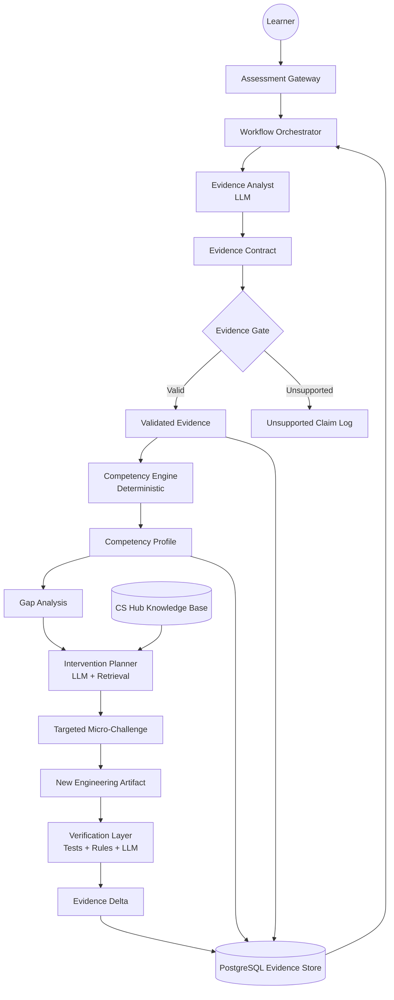
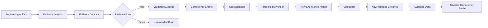

# MidPath AI — System Architecture

> **Evidence-Gated Agentic Architecture for Engineering Competency Diagnosis**

## 1. Architecture Objective

MidPath AI is designed to answer one question reliably:

> **What engineering competencies can a learner demonstrate through observable evidence, and what evidence is still missing?**

The architecture is intentionally designed around evidence rather than unrestricted LLM judgment.

LLMs may reason probabilistically.

Persistent competency claims, however, must be supported by traceable evidence.

---

## 2. Architectural Principles

### 2.1 Evidence-Driven

The system evaluates engineering competence through observable artifacts such as:

- source code;
- tests;
- schemas;
- API contracts;
- execution results;
- architecture decisions.

A competency claim should not rely solely on model opinion.

---

### 2.2 Evidence-Gated

An LLM observation is treated as a hypothesis until its supporting evidence satisfies the Evidence Contract.

```text
LLM Observation
      ↓
Evidence Contract
      ↓
Evidence Gate
      ↓
Validated Evidence
```

Architectural invariant:

> **No strong competency claim without traceable evidence.**

---

### 2.3 Closed-Loop

MidPath does not stop after diagnosis.

```text
Assessment
    ↓
Diagnosis
    ↓
Intervention
    ↓
Verification
    ↓
Evidence Delta
```

The purpose of an intervention is to generate new evidence that can be reassessed.

---

### 2.4 Traceability

Every persistent competency assessment must be traceable to:

```text
Competency Claim
       ↓
Evidence
       ↓
Artifact
       ↓
Location / Observation
```

This allows the system to explain why a competency level was assigned.

---

### 2.5 Hybrid Intelligence

MidPath does not use LLMs for every decision.

The architecture separates:

```text
Probabilistic Reasoning
        ↓
       LLM

Deterministic Validation
        ↓
Rules / Rubrics / Contracts

Empirical Verification
        ↓
Tests / Execution / Tools
```

AI is used where semantic reasoning provides value.

Deterministic logic is preferred where reproducibility and consistency are more important.

---

### 2.6 Minimal Necessary Complexity

Every component must justify its existence through:

- an identified problem;
- an observed failure mode;
- measurable improvement;
- or a reproducibility requirement.

Additional agents, retrieval systems, memory, or tools should not be added solely to increase architectural complexity.

---

# 3. High-Level Architecture



---

# 4. Architectural Layers

MidPath is divided into five conceptual layers.

```text
┌──────────────────────────────────────────┐
│             EXPERIENCE LAYER             │
│      Assessment Gateway / Web UI         │
├──────────────────────────────────────────┤
│             WORKFLOW LAYER               │
│              Orchestrator                │
├──────────────────────────────────────────┤
│          INTELLIGENCE LAYER              │
│ Evidence Analyst / Intervention Planner  │
├──────────────────────────────────────────┤
│          VALIDATION LAYER                │
│ Evidence Gate / Competency Engine /      │
│ Verification                             │
├──────────────────────────────────────────┤
│             DATA LAYER                   │
│ PostgreSQL / Artifacts / Knowledge       │
└──────────────────────────────────────────┘
```

---

# 5. Assessment Gateway

The Assessment Gateway is the entry point of the system.

It receives:

- task information;
- learner submission;
- engineering artifacts;
- optional self-assessment metadata.

Its responsibility is to normalize the assessment request and initiate the workflow.

It does not assign competency scores.

---

# 6. Workflow Orchestrator

The Workflow Orchestrator coordinates the evaluation lifecycle.

Responsibilities include:

1. registering an assessment;
2. invoking evidence analysis;
3. validating returned evidence;
4. invoking deterministic competency mapping;
5. persisting assessment results;
6. triggering intervention planning when appropriate;
7. initiating verification after a new submission.

The orchestrator owns workflow state but does not perform semantic competency judgment itself.

---

# 7. Evidence Analyst

## Type

**LLM-assisted component**

The Evidence Analyst inspects engineering artifacts and extracts structured observations.

Examples:

- transaction usage;
- REST semantics;
- input validation;
- test coverage patterns;
- error handling;
- duplicate-request protection;
- persistence constraints;
- concurrency handling.

The Evidence Analyst does not directly update the learner's persistent competency profile.

Its output is a set of proposed Evidence Contracts.

Example:

```json
{
  "competency": "idempotency",
  "level": 1,
  "confidence": 0.91,
  "evidence": [
    {
      "artifact": "src/payment.ts",
      "location": "L42-L61",
      "observation": "No idempotency-key validation was detected."
    }
  ],
  "missing_evidence": [
    "duplicate-request test",
    "concurrent-request test"
  ],
  "reasoning_summary": "The implementation does not demonstrate duplicate-request safety."
}
```

---

# 8. Evidence Contract

The Evidence Contract defines the boundary between probabilistic reasoning and persistent system knowledge.

Every proposed competency claim must contain:

```text
competency
level
confidence
evidence[]
missing_evidence[]
reasoning_summary
```

Every evidence entry should identify:

```text
artifact
location
observation
```

The contract makes agent outputs:

- structured;
- testable;
- traceable;
- comparable;
- persistable.

---

# 9. Evidence Gate

## Type

**Deterministic validation component**

The Evidence Gate determines whether a proposed claim satisfies the minimum evidence requirements.

It verifies:

- artifact existence;
- required contract fields;
- valid competency identifier;
- valid classification range;
- evidence structure;
- claim/evidence consistency rules where deterministic validation is possible.

Possible outcomes:

```text
PROPOSED CLAIM
      │
      ▼
 EVIDENCE GATE
   ┌──┴──┐
   │     │
 PASS  REJECT
   │     │
   ▼     ▼
VALID  UNSUPPORTED
```

Rejected claims remain available for failure analysis but do not become strong persistent competency claims.

---

# 10. Competency Engine

## Type

**Deterministic component**

The Competency Engine maps validated evidence against the predefined competency rubric.

The initial competency taxonomy contains:

1. REST API Design & Contracts
2. Data Persistence & Relational Modeling
3. Automated Testing
4. Error Handling
5. Idempotency & Reliability

Classification uses:

| Level | Meaning |
|---:|---|
| 0 | No Evidence |
| 1 | Weak Evidence |
| 2 | Partial Evidence |
| 3 | Strong Evidence |

Using deterministic mapping where possible reduces variability between repeated evaluations.

---

# 11. Competency Profile

The Competency Profile represents the learner's current evidence-supported state.

Example:

```text
Backend Engineering

REST API Design             3  Strong
Persistence                 2  Partial
Testing                     2  Partial
Error Handling              1  Weak
Idempotency & Reliability   1  Weak
```

Each level must be traceable to supporting evidence.

The profile is therefore not simply a model-generated score.

It is a projection of validated evidence against the competency rubric.

---

# 12. Gap Analysis

Gap Analysis compares:

```text
Expected Evidence
        vs.
Validated Evidence
```

The output identifies the smallest meaningful competency gap that can be addressed through an intervention.

Example:

```text
Competency:
Idempotency & Reliability

Existing Evidence:
✓ successful request processing

Missing Evidence:
✗ duplicate-request protection
✗ concurrent-request behavior
✗ idempotency test
```

---

# 13. Intervention Planner

## Type

**LLM-assisted component with contextual retrieval**

The Intervention Planner receives a validated competency gap and generates a targeted micro-challenge.

Unlike the Evidence Analyst, this component may use the CS Hub Knowledge Base because educational context directly supports intervention generation.

Conceptually:

```text
Validated Gap
      +
Competency Context
      +
CS Hub Knowledge
      ↓
Intervention Planner
      ↓
Targeted Micro-Challenge
```

An intervention must be:

- targeted;
- minimal;
- measurable;
- directly related to missing evidence;
- capable of producing a new engineering artifact.

Example:

```text
Gap:
No evidence of concurrency-safe idempotency.

Intervention:
Modify the payment endpoint to safely handle duplicate
concurrent requests and provide an automated test that
demonstrates the behavior.
```

Retrieval is introduced here only when it improves intervention relevance.

---

# 14. Verification Layer

Verification uses the most deterministic mechanism available for each type of claim.

It may combine:

### Automated Tests

For executable behavior.

### Deterministic Rules

For structural constraints and rubric validation.

### LLM Analysis

For semantic engineering decisions that cannot be reliably verified through deterministic execution alone.

Conceptually:

```text
New Artifact
     ↓
┌──────────────┐
│ Verification │
├──────────────┤
│ Tests        │
│ Rules        │
│ LLM          │
└──────┬───────┘
       ↓
New Validated Evidence
```

The verification result is passed through the same evidence principles used during the original assessment.

---

# 15. Evidence Delta

Evidence Delta measures how the validated competency evidence changed after intervention.

Conceptually:

```text
Previous Evidence
       ↓
Targeted Intervention
       ↓
New Artifact
       ↓
Verification
       ↓
New Evidence
       ↓
Evidence Delta
```

Example:

```text
Idempotency & Reliability

Before: 1 — Weak Evidence
After:  2 — Partial Evidence

Delta: +1
```

The delta does not automatically prove generalized learning.

It demonstrates that the learner produced stronger evidence for the evaluated competency under the defined task.

---

# 16. PostgreSQL Evidence Store

PostgreSQL acts as the persistent evidence and assessment store.

It maintains relationships between:

```text
Learner
   ↓
Assessment
   ↓
Artifact
   ↓
Evidence
   ↓
Competency Claim
   ↓
Competency Assessment
   ↓
Intervention
   ↓
Verification
   ↓
Evidence Delta
```

The database is designed for traceability rather than simply storing final scores.

A final competency classification should always be explainable by traversing back to the evidence that produced it.

---

# 17. Knowledge Retrieval Boundary

The CS Hub Knowledge Base is not treated as universal context for every agent.

Its primary architectural role is:

```text
Competency Gap
      ↓
Intervention Planner
      ↓
Relevant Learning Context
      ↓
Targeted Challenge
```

This boundary prevents retrieval complexity from being introduced into components where it has not demonstrated value.

If experimentation shows that retrieval improves another component, that change must be documented in the Improvement Changelog.

---

# 18. Closed-Loop Workflow



This creates the complete loop:

```text
ASSESS
   ↓
DIAGNOSE
   ↓
INTERVENE
   ↓
VERIFY
   ↓
MEASURE
```

---

# 19. Why Hybrid Instead of Fully Agentic?

A fully agentic architecture could assign every task to an LLM.

MidPath intentionally avoids that approach.

For example:

```text
Evidence interpretation       → LLM-assisted

Evidence schema validation    → Deterministic

Competency classification     → Deterministic rubric

Intervention generation       → LLM-assisted

Executable verification       → Automated tests

Semantic verification         → LLM-assisted
```

This provides a clearer separation between:

- interpretation;
- judgment;
- validation;
- verification.

The architecture uses probabilistic intelligence where semantic reasoning is necessary and deterministic mechanisms where consistency and reproducibility are more valuable.

---

# 20. Architectural Invariants

The following rules must remain true throughout implementation.

### INV-01 — Traceability

Every persistent competency claim must be traceable to evidence.

### INV-02 — Evidence Gate

Unsupported strong claims must not modify the competency profile.

### INV-03 — Shared Rubric

Baseline, MidPath, and Gold Standard must use the same competency definitions and classification scale.

### INV-04 — Reproducibility

The same evaluation case must be executable from a clean environment.

### INV-05 — Separation of Responsibilities

LLM reasoning, deterministic validation, and empirical verification must remain distinguishable.

### INV-06 — Measured Complexity

A new agent, tool, retrieval mechanism, or persistence capability must address an identified need or experimentally observed failure mode.

---

# 21. Architecture Decision Summary

| Concern | Decision | Rationale |
|---|---|---|
| Semantic evidence extraction | LLM | Requires interpretation |
| Agent output format | Evidence Contract | Structured and testable |
| Unsupported claims | Evidence Gate | Prevent ungrounded persistence |
| Competency mapping | Deterministic rubric | Consistency |
| Persistence | PostgreSQL | Relational traceability |
| Educational retrieval | CS Hub Knowledge | Targeted intervention context |
| Behavioral verification | Automated tests | Objective evidence |
| Complex semantic verification | LLM-assisted | Handles non-deterministic reasoning |
| Workflow coordination | Orchestrator | Explicit lifecycle management |

---

# 22. Core Architecture Concept

The central architecture can be summarized as:

```text
Engineering Artifact
        ↓
Probabilistic Observation
        ↓
Evidence Contract
        ↓
Evidence Gate
        ↓
Validated Evidence
        ↓
Deterministic Competency Mapping
        ↓
Gap Diagnosis
        ↓
Targeted Intervention
        ↓
New Engineering Artifact
        ↓
Verification
        ↓
Evidence Delta
        ↓
Updated Competency Profile
```

The fundamental principle is:

> **An agent may reason probabilistically, but competency claims must pass through an evidence gate before becoming part of the learner's persistent profile.**